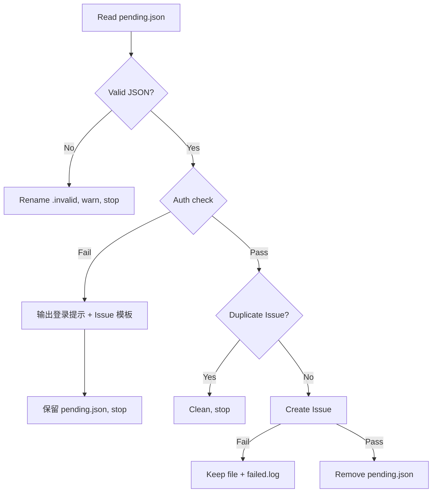

# gitflow-autoreport-bug

Detects `pending.json` → validates → auth check → dedup → Claude analysis → creates Issue → cleans up.

## Decision Flow

## Auth 失败处理

当 `gitflow-cli auth status` 返回未登录时，不要尝试创建 Issue。改为：

1. 输出登录提示：`gh auth login`
2. 输出手动 Issue URL：`https://github.com/byx-darwin/gitflow-cli/issues/new`
3. 格式化 `pending.json` 内容为可复制的 Issue 模板：
   - **命令**: `{command}`
   - **平台**: `{platform}`
   - **错误码**: `{error_code}`
   - **错误信息**: `{error_message}`
   - **时间**: `{timestamp}`
4. 保留 `pending.json`，不做清理（等待用户登录后下次触发）

## ⚠️ Responsibility Boundary

**This skill ONLY detects and reports bugs. It NEVER fixes bugs.**

### 🚫 Forbidden

- ❌ Modify any code files — even if you think you know the bug cause
- ❌ Launch subagents to fix — no code modification flows
- ❌ Trigger `gitflow-workflow` repair — no auto-repair workflows
- ❌ Analyze source code or attempt fixes — analysis only, no remediation
- ❌ Continue after Issue creation — end immediately after Issue is created

### ✅ Scope

- Read `pending.json`, validate JSON
- Auth check (GitHub login verification)
- Dedup via existing Issue search
- Analyze root cause (analysis only, no fixes)
- Create Issue with `[auto-report]` prefix
- Clean up `pending.json` on success

### 🔧 Fix Flow (User-Initiated Only)

User must manually run `/gitflow-workflow --fast` or explicitly request fix.

## Target Repository

**All auto-reports → fixed repo:** `byx-darwin/gitflow-cli`

Always use `--repo byx-darwin/gitflow-cli` for dedup and issue creation.

## Workflow

1. **Read & Validate** — `.cache/bug-reports/pending.json`. Required: `id`, `command`, `platform`, `error_code`, `error_message`, `timestamp`. Invalid → rename `.invalid`, stop. Pre-check: `command -v gitflow-cli`.
2. **Auth Check** — `gitflow-cli auth status --platform {platform}`. Pass → proceed. Fail → output login prompt + Issue template, keep `pending.json`, stop.
3. **Dedup** — `gitflow-cli issue list --repo byx-darwin/gitflow-cli --search "[auto-report] {command} {error_code}"`. Match → clean, stop.
4. **Create Issue** — Analyze root cause, fix direction, severity. Create Issue via `gitflow-cli issue create --repo byx-darwin/gitflow-cli --title "[auto-report] gitflow {command} — {error_code}" --label "auto-report"`. Fail → keep file + `failed.log`.
5. **Cleanup** — `rm -f .cache/bug-reports/pending.json`.

## Error Handling

| Error | Action |
|-------|--------|
| Missing `pending.json` | "No pending reports", stop |
| Invalid JSON | Rename to `.invalid`, warn, stop |
| Auth check failure | Output login guide + Issue template, keep `pending.json` |
| Dedup hit | Clean `pending.json`, show existing Issue |
| Issue creation failure | Keep `pending.json` + log to `failed.log` |

For Schema and failed.log format, see `docs/references/gitflow-autoreport-bug-params.md`.

## Common Mistakes

- ❌ **Attempting to fix the bug** — this skill reports only; fixes require user-initiated workflow
- ❌ **Skipping dedup** — always search before creating to avoid duplicate Issues
- ❌ **Missing --repo** — always use `--repo byx-darwin/gitflow-cli`
