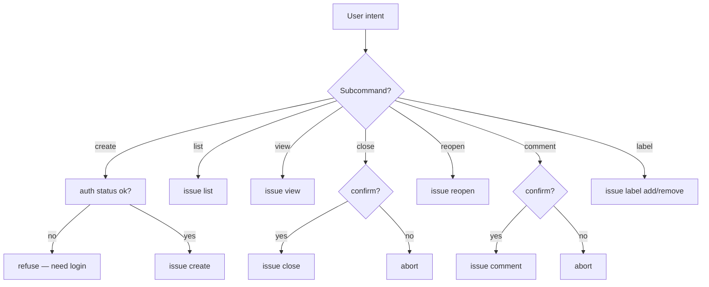

# gitflow-issue

## Overview

Wraps `gitflow-cli issue`. 7 subcommands: `create · list · view · close · reopen · comment · label`.

## When to Use

| Trigger | 中文 | Redirect |
|---------|------|----------|
| create / open | 创建 Issue | — |
| list / view | 列出 Issue | — |
| view / show #N | #N 详情 | — |
| close / resolve | 关闭 Issue | — |
| reopen | 重新打开 | — |
| add comment | 添加评论 | — |
| add label | 添加标签 | — |
| full workflow | 全流程 | → `gitflow-issue-create` |
| analyze requirements | — | → `gitflow-issue-review` |

## Core Pattern

```bash
gitflow-cli issue create --title <t> --body <b> --label <l> --assignee <a>
gitflow-cli issue list [--state open|closed|all] [--label <l>] [--limit <n>]
gitflow-cli issue view <number>
gitflow-cli issue close <number>
gitflow-cli issue reopen <number>
gitflow-cli issue comment <number> --body <text>
gitflow-cli issue label <number> --add <l> --remove <l>
```

## Preconditions

```bash
git rev-parse --is-inside-work-tree
command -v gitflow-cli
gitflow-cli auth status
```

## Quick Reference

| Goal | Command | Precondition |
|------|---------|--------------|
| Create | `issue create --title <t> --label <l>` | Auth |
| List | `issue list [--state] [--label] [--limit]` | In repo |
| View | `issue view <number>` | Issue exists |
| Close | `issue close <number>` | Issue open |
| Reopen | `issue reopen <number>` | Issue closed |
| Comment | `issue comment <number> --body <text>` | Issue exists |
| Label | `issue label <number> --add <l> --remove <l>` | Issue exists |

## Flowchart



## Responsibility

**In:** select sub-command · run read or state change · format output · record action.

**Out:** interactive workflow (`gitflow-issue-create`) · triage (`gitflow-issue-review` · `gitflow-issue-triage`) · bulk operations · mutating others' issues without confirmation.

### 🚫 Do Not

- ❌ Bulk-close/list-update — ask user to scope
- ❌ Modify non-label fields via `issue label` — not supported
- ❌ Delete comments — not supported

## Rationalization Excuses

| Excuse | Reality |
|--------|---------|
| "User said close, just do it" | Confirm issue number first |
| "Auth cached, skip status" | Always validate auth |
| "Auto-add label" | Explicit user approval |
| "Already created, don't notify" | Always report created URL |

## Red Flags

- 🚩 "Close all open issues" — scope with user
- 🚩 "Delete issue" — `gh issue delete`
- 🚩 "Edit issue title" — not supported; web UI
- 🚩 "Archive project" — out of scope

## Error Handling

| Error | Recovery |
|-------|----------|
| Not in git repo | `cd` or `gitflow-cli repo clone` |
| Unauthenticated | `gitflow-cli auth login` |
| Issue not found | 404; confirm number |
| Create duplicate | `issue list --search` |
| Rate limit | Pause then retry |
| Label missing | `gitflow label list` |
| Close already-closed | no-op + state note |

## Test Scenarios

### 1: Happy Path
- **Given** "create: title=X label=bug" · **Then** `issue create` → output URL

### 2: Negative
- **Given** "do review issue #5" · **Then** → `gitflow-issue-review`

### 3: Boundary
- **Given** close already-closed #N · **Then** no-op + state note

### 4: Error
- **Given** auth missing · **Then** `gitflow-cli auth login` first

## Success Criteria

- [ ] Correct sub-command per trigger
- [ ] Issue number confirmed for state changes
- [ ] Auth checked before mutation
- [ ] Created issue URL reported
- [ ] Unsupported ops redirected early

## Common Mistakes

- ❌ **Skipping sub-command dispatch** — route by trigger keyword, never assume intent.
- ❌ **Closing without confirmation** — state-change always requires explicit user OK.

## See Also

- `gitflow-issue-create` — interactive creation
- `gitflow-issue-review` — requirement analysis
- `gitflow-issue-triage` — classification
- `gitflow-label-milestone` — labels/milestones
- `gitflow-autoreport-bug` — auto-create from CLI error
- `gitflow-workflow` — end-to-end workflow
- `gitflow-pr` — PR linking

## Trigger Keywords

| English | 中文 |
|---------|------|
| create issue, open issue | 创建 Issue |
| list issues, view issues | 列表 Issue |
| show #N, view #N | 查看 #N |
| close issue, resolve | 关闭 Issue |
| reopen issue | 重新打开 |
| add comment | 添加评论 |
| add label, tag | 添加标签 |
