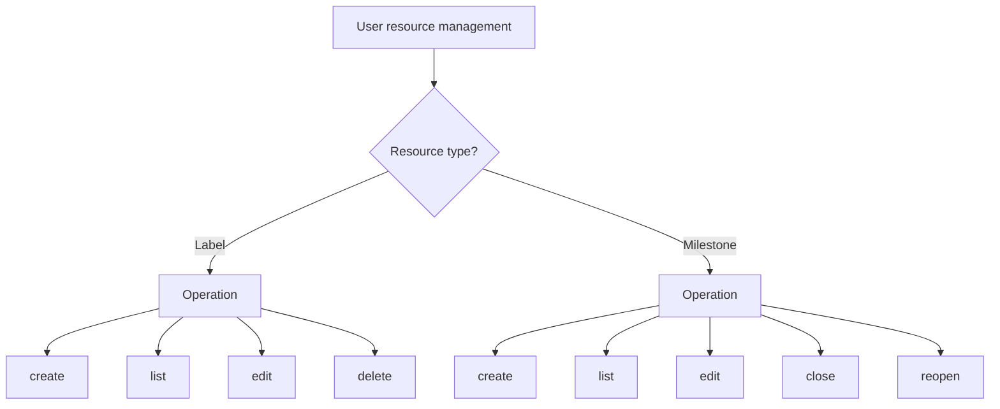

# gitflow-label-milestone — Label & Milestone CRUD

Encapsulates CRUD operations for `gitflow-cli label` and `milestone` command families.
Detailed parameters: docs/references/gitflow-label-milestone-params.md

## Overview

Unified CRUD router for Labels (4 ops) and Milestones (5 ops).

## Trigger Keywords

CN 创建标签 标签颜色 编辑里程碑 关闭里程碑 版本规划 删除标签
EN manage labels milestone CRUD label color due date close reopen
CLI `gitflow-cli label|milestone <subcommand>`

## CRUD Matrix

## Quick Reference

| Command | Key Flags |
|---------|-----------|
| `label create` | `--name` `--color` [`--description`] |
| `label edit <name>` | [`--name`] [`--color`] [`--description`] |
| `label delete <name>` | — |
| `label list` | — |
| `milestone create` | `--title` [`--description`] [`--due-on`] |
| `milestone edit <n>` | [`--title`] [`--description`] [`--due-on`] |
| `milestone close/reopen <n>` | — |
| `milestone list` | — |

See external docs for parameter types.

## Pattern Triplets

| User Input | Action |
|---------|------|
| "create bug label" | `label create --name bug --color d73a4a` |
| "create v1.0 milestone" | `milestone create --title "v1.0" --due-on 2026-06-01T00:00:00Z` |
| "close milestone #1" | `milestone close 1` |

## ✅ In Scope / 🚫 Out of Scope

✅ CRUD command routing and parameter quick reference
🔴 Never auto-label issues / batch delete / bypass delete confirmation

## Red Flags + Defense

- "Close all bug issues" → outside this skill's scope
- "Use a past due date" → refuse; require a future date

## Common Mistakes

| Mistake | Fix |
|------|------|
| Color without `#` | Expects a 6-digit hex without `#` |
| Date not in ISO 8601 format | Prompt to correct |

## Rationalization

"Just add a few labels to the issue while I'm at it" → not CRUD; labeling decisions belong to the triage skill

## Error Handling

| Error | Handling |
|------|------|
| Invalid hex color | Require 6 digits of 0-9 a-f |
| Deleting a referenced label | Warn, then require explicit `--force`, otherwise refuse |
| `due-on` not ISO 8601 | Refuse and show the expected format |

## Test Scenarios

- **Happy**: "create bug label" → `label create --name bug --color d73a4a` → details
- **Negative**: "label all issues as bug" → refuse; suggest using the triage skill first
- **Boundary**: "delete label bug" but bug is referenced by 3 issues → warn about the associations
- **Error**: "edit nonexistent label xxx" → 404 → prompt for confirmation

## Success Criteria

- CRUD commands route correctly
- Color/due-on format validation warns before the command fails
- Destructive operations require confirmation

## See Also

- gitflow-issue — assigns labels and milestones to issues
- gitflow-issue-triage — relies on labels during triage
- gitflow-release — associates milestones during release
- gitflow-weekly-report — tracks milestone progress
