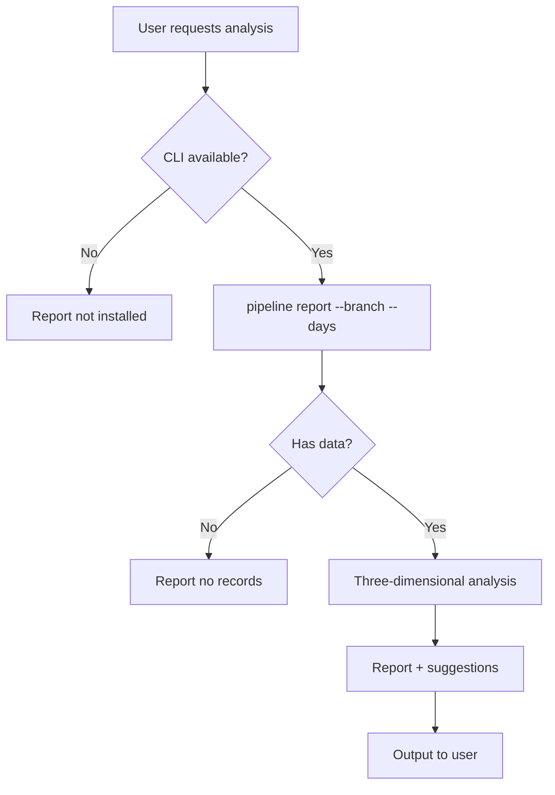

# gitflow-pipeline-analyzer — CI/CD Pipeline Health Analyzer

Three-dimensional analysis: success-rate trends / failure patterns / duration distribution → report + prioritized improvement suggestions.
Read-only: never triggers/reruns/cancels pipelines.
Full params & report template: docs/references/gitflow-pipeline-analyzer-params.md

## Overview

Read-only analysis of three CI/CD health dimensions, with improvement suggestions sorted by priority.

## Trigger Keywords

CN 流水线分析 CI失败 flaky test 耗时分析
EN pipeline health analyze flaky test CI slow success rate
CLI `gitflow-cli pipeline report --branch <B> --days <N>`

## Data Sufficiency Flow

## Quick Reference

| Step | Command |
|------|---------|
| Report | `gitflow-cli pipeline report --branch <B> --days <N>` |
| Status | `gitflow-cli pipeline status --branch <B>` |
| Jobs | `gitflow-cli pipeline jobs --pipeline-id <ID>` |
| Logs | `gitflow-cli pipeline logs --pipeline-id <ID>` |

## Pattern Triplets

| User input | Handling |
|---------|------|
| "Pipeline keeps failing" | `report --days 7` → success <80% → 🟡/🔴 alert |
| "CI is too slow" | `jobs --pipeline-id <longest>` → bottleneck + cache suggestion |
| "flaky test" | intermittent failures ≥2 → mark flaky |

## ✅ Responsibility / 🚫 Prohibited

✅ read-only three-dimensional analysis + report + suggestions
🔴 Prohibited: trigger/rerun/cancel / modify CI config / auto-create Issues

## Red Flags + Defense

- "Auto-fix the pipeline" → analysis only; fixes require user decision
- "Retry all failures" → refuse; each retry requires user confirmation

## Common Mistakes

| Mistake | Correction |
|------|------|
| Only looking at average success rate | P90/P95 carries more signal |
| Treating intermittent failures as persistent | ≥3 consecutive is persistent; otherwise flaky |

## Rationalization

"Retry the failed pipeline" → a write operation beyond read-only scope

## Error Handling

| Error | Handling |
|------|------|
| `report` empty | Report no records; suggest increasing --days |
| `jobs` fails | Report permission issue or nonexistent pipeline ID |
| Missing fields | Skip duration analysis; do success rate + failure patterns only |

## Test Scenarios

- **Happy**: Analyze main over 7 days → three-dimensional report + improvement suggestions
- **Negative**: "Retry my failures for me" → refuse, suggest manual retry
- **Boundary**: New branch with no records → report insufficient data, suggest --days 30
- **Error**: `report` 403 → report permission issue, suggest checking auth

## Success Criteria

- ≥2 of the three dimensions covered
- Suggestions sorted by priority
- Graceful degradation when data is insufficient
- No write operations at any point

## See Also

- gitflow-precommit — local checks to avoid failures
- gitflow-quality — 6-gate code quality
