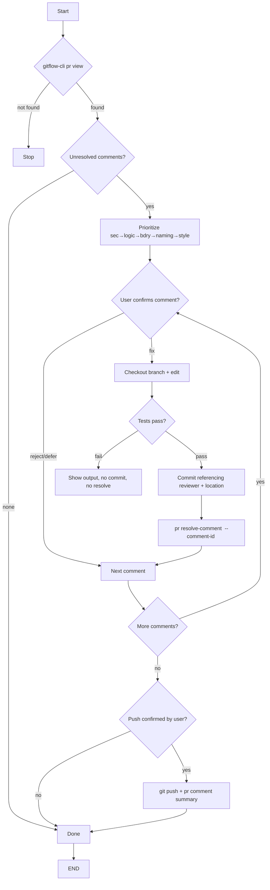

# gitflow-pr-apply-feedback

## Overview

Fetch pending review feedback · prioritize (security → logic → boundary → naming → style) · apply per-comment fix after user confirmation · mark resolved · push + notify reviewer. Does not review or merge.

## When to Use

| Trigger | 中文 | Redirect |
|---------|------|----------|
| apply / address / resolve feedback | 应用/处理审查反馈 | — |
| resolve comments | 解决评论 | — |
| apply / pick up review | 审查后续 | — |
| review PR initially | 初次审查 | → `gitflow-pr-review` |
| inline diff review | 行内审查 | → `gitflow-pr-inline-review` |

## Core Pattern

```bash
gitflow-cli pr view <pr>                               # fetch + list pending
# prioritize → confirm each comment with user
git checkout <pr-branch>                                       # confirmed PR branch
# per comment: edit → test → commit (referencing reviewer + location)
gitflow-cli pr resolve-comment <pr> --comment-id <id>          # mark resolved
git push origin <pr-branch>                                    # ONLY after explicit confirmation
gitflow-cli pr comment <pr> --body "<summary>"                 # notify
```

## Preconditions

```bash
git rev-parse --is-inside-work-tree    # inside git repo
command -v gitflow-cli                  # CLI available
gitflow-cli auth status                 # authenticated
git rev-parse --abbrev-ref HEAD == <pr-branch>
```

## Responsibility

**In:** prioritize · apply fixes (confirmed) · test · resolve · push (confirmed) · notify.
**Out:** initial review · inline review · approve/merge.

### 🚫 Do Not

- ❌ Push without confirmation
- ❌ Resolve without passing tests
- ❌ Auto-accept all comments (user confirms each)

## Rationalization Excuses

| Excuse | Reality |
|--------|---------|
| "Comment is clear, just apply" | Every change needs user confirmation |
| "Small change, always OK" | Size never waives confirmation |
| "Reviewer rushing my PR" | Urgency ≠ skip verification |
| "Tests passed, resolve now" | User confirms per comment |

## Red Flags

- 🚩 "Apply all feedback" — confirm each comment
- 🚩 "Skip tests, resolve immediately" — tests must pass
- 🚩 "Push right now" — show summary; wait for explicit approval
- 🚩 Architectural change — discuss first, no auto-modify
- 🚩 PR branch unknown — confirm before `git checkout`

## Error Handling

| Error | Recovery |
|-------|----------|
| `pr view` — PR not found | Stop; report invalid PR number |
| Branch already on `pr-branch` | Fetch latest; confirm no uncommitted local work |
| Edit produces test failure | Do not commit; do not resolve; ask user to proceed or abort |
| `resolve-comment` fails | Log failure; continue to next comment; report at end |
| `git push` conflict | Stop; print conflict files; ask user to resolve |
| User rejects a comment | Skip; record as "rejected — user decision" |
| Ambiguous reviewer location (no line) | Ask user to disambiguate or skip |

## Flowchart



## Test Scenarios

### 1: Happy Path
- **Given** 3 pending comments · **When** "apply feedback" · **Then** Apply each (confirmed), test, commit, resolve, push (confirmed), notify

### 2: Negative
- **Given** "review PR" · **Then** → `gitflow-pr-review`

### 3: Boundary
- **Given** applied locally · **When** Claude tries push without confirmation · **Then** Violation — must show and wait

### 4: Error
- **Given** edit fails test · **Then** No commit/resolve; continue to next

## Success Criteria

- [ ] Each modification confirmed before commit
- [ ] Tests pass before resolve
- [ ] Push only after user confirmation
- [ ] Reviewer notified via `gitflow-cli pr comment <pr>`
- [ ] No out-of-scope commands

## Common Mistakes

- ❌ **Pushing without confirmation** — always show draft and await user OK.
- ❌ **Merging after applying feedback** — merging is a separate skill.

## See Also

- `gitflow-pr-review` — initial code review
- `gitflow-pr-inline-review` — inline per-line review
- `gitflow-pr` — PR lifecycle
- `gitflow-commit` — commit conventions
- `gitflow-precommit` — pre-commit gates before push
- `gitflow-quality` — post-fix quality verify

## Trigger Keywords

| English | 中文 |
|---------|------|
| apply feedback, address feedback | 应用反馈, 处理反馈 |
| resolve comments, pick up comments | 解决评论, 处理评论 |
| review follow-up, review changes | 审查后续, 审查修改 |
