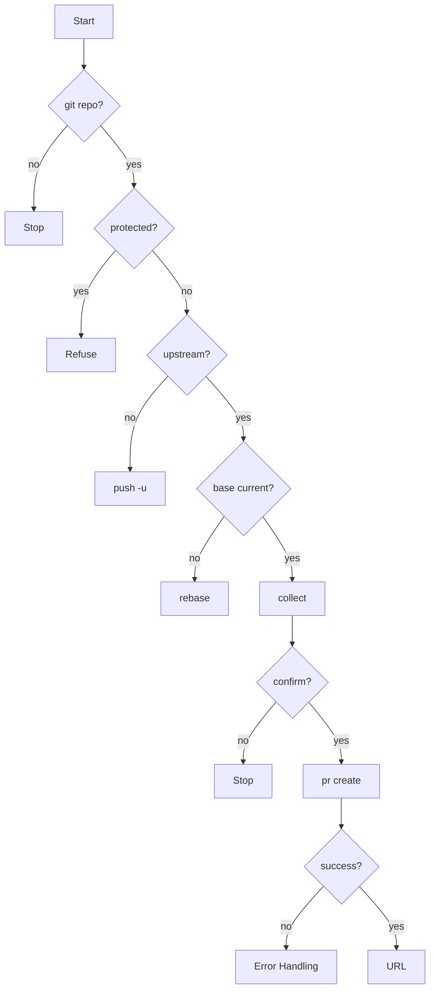

# gitflow-pr-create

Validates branch state, collects title/description, invokes `gitflow-cli pr create`, returns the new PR URL. Does not review, approve, merge, or close PRs.

## When to Use

| English | 中文 | Context |
|---------|------|---------|
| create a PR | 创建 PR | feature/fix branch ready |
| submit for review | 提交供审查 | pushed, awaiting reviewer |
| draft PR | 草稿 PR | work-in-progress |
| merge request | 合并请求 | GitLab terminology |

## Core Pattern

```bash
command -v gitflow-cli && gitflow-cli auth status
git rev-parse --is-inside-work-tree
git branch --show-current
git rev-parse --abbrev-ref @{u}
git merge-base --is-ancestor origin/main HEAD
gitflow-cli pr create -t "<title>" -b "<body>" -H <head> -B <base> [--draft]
```

## Quick Reference

| Goal | Command |
|------|---------|
| Create | `gitflow-cli pr create -t "<t>" -b "<b>" -H <head> -B <base> [--draft]` |
| Push upstream | `git push -u origin <branch>` |
| Rebase | `git rebase origin/<base>` |

## Implementation

### Preconditions

- Git repo — `git rev-parse --is-inside-work-tree`
- CLI + auth — `command -v gitflow-cli` + `gitflow-cli auth status`

### Step 1: Branch — not protected, has upstream. Else stop.

### Step 2: Changes + Base — diff warns non-conformant commits; stale base → rebase, stop.

### Step 3: Collect title (conventional prefix) + body (Markdown template). Confirm command.

### Step 4: Invoke `gitflow-cli pr create`. Success → URL. Failure → Error Handling.

### Error Handling

| Error | Recovery |
|-------|----------|
| Protected branch | Refuse. Stop. |
| No upstream | `git push -u`. Stop. |
| Base outdated | Rebase. Stop. |
| Auth failure | `auth login`. Stop. |
| Network timeout | Surface. No retry alone. |

## Flowchart



## Responsibility

### ✅ In Scope

- Validate branch
- Review scope + base freshness
- Collect conventional-commit title + body
- Confirm `--head` / `--base` / `--draft`
- Invoke CLI, return URL

### ❌ Out of Scope

- Reviewing → `/gitflow-pr-review`
- Feedback → `/gitflow-pr-apply-feedback`
- Merge / close → `/gitflow-pr`
- CI/CD → `/gitflow-pipeline-analyzer`

### 🚫 Do Not

- ❌ Create from protected branch
- ❌ Create without upstream — push first
- ❌ Merge after creation
- ❌ Add reviewers without approval
- ❌ Force-push without confirmation in one invocation

## 🔁 Delegation Rules

| User Intent | Delegate To | Reason |
|-------------|-------------|--------|
| Create a PR | This skill | Branch validation + title/desc |
| Review / inline / apply feedback | review sibling skills | Per their scope |
| Merge / close / reopen | `/gitflow-pr` | Lifecycle operation |
| Check CI | `/gitflow-pipeline-analyzer` | Pipeline health |

## Rationalization Excuses

| Excuse | Reality |
|--------|---------|
| "Skip base freshness" | Stale base produces hidden merge conflicts |
| "Just run it, skip approval" | Command must be confirmed first |
| "PR looks good, merge it" | Out-of-scope; redirect to `/gitflow-pr` |

## Red Flags

- 🚩 "Skip the base check" — Stop.
- 🚩 "Create from main" — Protected. Stop.
- 🚩 "Merge after creating" — → `/gitflow-pr`.
- 🚩 CLI fails → improvise — Follow Error Handling.

## Test Scenarios

### Scenario 1: Happy Path — `feature/ssh-auth`, upstream OK. "create a PR" → validates, invokes CLI, returns URL.

### Scenario 2: Negative — "review PR #42" → NOT loaded. → `/gitflow-pr-review`.

### Scenario 3: Boundary — PR created, "merge it" → Refuses. → `/gitflow-pr`.

### Scenario 4: Error — Base outdated → rebase advised, stops. No `pr create`.

### Scenario 5: Error — No upstream → `git push -u`, stops. No `pr create`.

## Success Criteria

- [ ] PR URL returned
- [ ] Branch validated (not protected, has upstream)
- [ ] Base freshness confirmed
- [ ] User confirmed command

## Common Mistakes

- ❌ **PR from protected branch** — Validate current branch.
- ❌ **Skipping base check** — Always verify merge-base.
- ❌ **Missing conventional prefix** — Prompt user.

## Trigger Keywords

| English | 中文 |
|---------|------|
| create a PR | 创建 PR |
| submit for review | 提交供审查 |
| draft PR | 草稿 PR |
| merge request | 合并请求 |

## See Also

- `gitflow-pr` — close, approve, merge PR lifecycle
- `gitflow-pr-review` — initial code review
- `gitflow-pr-inline-review` — inline review comments
- `gitflow-pr-apply-feedback` — apply reviewer feedback
