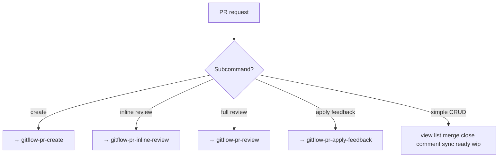

# gitflow-pr — PR Command Router

Top-level entry for `gitflow-cli pr` (11 subcommands). Simple CRUD; complex workflows delegate.

## When to Use

| EN | ZH |
|----|----|
| create PR | 创建PR |
| list / view / close / merge | 列出/查看/关闭/合并 |
| checkout / comment / sync | 检出/评论/同步 |
| ready / wip / draft | 标记就绪/草稿 |
| PR review | delegate → review skill |

## Flowchart

## Quick Reference

| Goal | Command |
|------|---------|
| List/View | `gitflow-cli pr list` / `pr view <n>` |
| CRUD local | `pr close/reopen/comment <n>` |
| Merge | `pr merge <n> --strategy <s>` (confirm first) |
| Sync | `pr sync <n>` |

## Responsibility

**In:** route sub-commands · execute simple CRUD · delegate complex workflows.
**Out:** skip merge confirmation · merge on CI-only basis.

### 🚫 Do Not

- ❌ Merge without explicit user confirm
- ❌ Merge when CI fails

## Rationalization Excuses

| Excuse | Reality |
|--------|---------|
| "CI passed — just merge" | PR review must precede merge; CI is necessary not sufficient. |
| "Rebase faster" | Rewriting shared history requires explicit consent. |

## Red Flags

- 🚩 "Skip strategy confirm" — refuse; merge strategy must be explicit
- 🚩 "Merge now, review later" — refuse; review precedes approval
- 🚩 "Force push after rebase" — refuse; confirm non-shared state

## Common Mistakes

- ❌ **Creating PR outside `gitflow-pr-create`** — always delegate creation.
- ❌ **Approving inline comments as PR approval** — different skills.

## Trigger Keywords

| EN | ZH |
|----|----|
| create PR, list PR, view PR | 创建PR, 列出PR, 查看PR |
| close PR, merge PR, comment PR | 关闭PR, 合并PR, 评论PR |
| sync PR, ready, wip | 同步PR, 标记就绪, 草稿 |

## Test Scenarios

### 1: Happy
- **Given** "squash merge #101" · **When** "confirm strategy" · **Then** `pr merge 101 --strategy squash` → output SHA

### 2: Negative
- **Given** "review PR #55" · **Then** NOT loaded → `/gitflow-pr-review`

### 3: Boundary
- **Given** CI passes · **When** "merge now" · **Then** Refuse — review required

### 4: Error
- **Given** 404 on close · **Then** "PR not found" ; stop

## Success Criteria

- [ ] Sub-command correctly routed
- [ ] Destructive ops require confirm
- [ ] No out-of-scope commands executed

## See Also

- `/gitflow-pr-create` — PR creation workflow
- `/gitflow-pr-review` — full review
- `/gitflow-pr-inline-review` — line-level review
- `/gitflow-pr-apply-feedback` — post-review code changes
