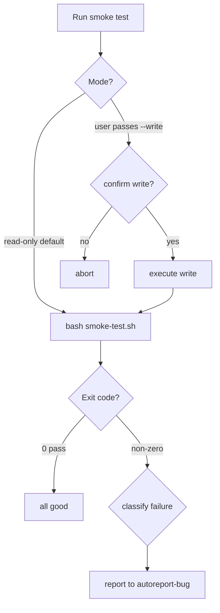

# gitflow-regression

Runs `scripts/smoke-test.sh`, parses PASS/FAIL/SKIP, delegates real failures to `/gitflow-autoreport-bug`. Defaults to `--read-only`. Does not fix bugs, edit scripts, or modify remotes.

## When to Use

| English | 中文 | Context |
|---------|------|---------|
| smoke test | 冒烟测试 | quick CLI check |
| regression test | 回归测试 | post-change verification |
| pre-release check | 发版前检查 | before release |
| run smoke | 跑一下冒烟 | casual trigger |

## Core Pattern

```bash
test -f scripts/smoke-test.sh
bash scripts/smoke-test.sh --platform github 2>&1
# parse EXIT + PASS/FAIL/SKIP
# FAIL>0 → classify → /gitflow-autoreport-bug
```

## Quick Reference

| Goal | Command |
|------|---------|
| Read-only | `bash scripts/smoke-test.sh --platform github` |
| Verbose | `bash scripts/smoke-test.sh --platform github --verbose` |
| Write mode | `bash scripts/smoke-test.sh --platform github --write` |

Platforms: github, gitlab, gitcode. Default mode: read-only; `--write` requires explicit user confirmation.

## Flowchart



## Implementation

### Preconditions

- In git repo — `git rev-parse --show-toplevel`
- `scripts/smoke-test.sh` executable
- `gitflow-cli` on PATH — `command -v gitflow-cli`
- Auth valid — `gitflow-cli auth status` (auth-fail → `gitflow auth login`, stop)

### Steps

1. **Parameters** — platform default `github`; `--write` only on explicit user request.
2. **Run** — `bash scripts/smoke-test.sh --platform <p> [--write] [--verbose]`; capture output + exit code.
3. **Parse** — extract `PASS_COUNT`, `FAIL_COUNT`, `SKIP_COUNT`. Exit 0 → report, done. Else Step 4.
4. **Classify** — per `[FAIL]` line: `command not found` / `auth` (🔴 critical, skip report); `4xx`/`5xx` / `timeout` (🟠); `mismatch` (🟡). Auth/network = transient → no autoreport. Real bug → write `.cache/bug-reports/pending.json`, invoke `/gitflow-autoreport-bug`.
5. **Report** — render markdown summary table + per-failure detail + reported Issue URLs.

### Error Handling

| Error | Recovery |
|-------|----------|
| script missing | `chmod +x` or stop |
| auth/network fail | Stop. Advise `gitflow auth login` |
| flaky | Re-run once; flag if persists |
| >5 failures | Single collective Issue |

## Responsibility

### ✅ In Scope

- Run script, parse output, classify, delegate to autoreport, render report

### ❌ Out of Scope

- Fixing bugs — autoreport-bug reports only
- Editing `scripts/smoke-test.sh`
- Closing reported Issues

### 🚫 Do Not

- ❌ Run `--write` without explicit confirmation
- ❌ Report transient auth/network failures
- ❌ Invoke autoreport-bug from CI pipelines
- ❌ Duplicate-report known flaky failures

## 🔁 Delegation

| Intent | Delegate To |
|--------|-------------|
| Run smoke test | This skill |
| File bug | `/gitflow-autoreport-bug` |
| Fix root cause | `/gitflow-workflow` |
| Pre-release gate | `/gitflow-release` |

## Rationalization

| Excuse | Reality |
|--------|---------|
| "Just a smoke test" | Write mode still mutates remotes |
| "Auth later" | Auth-less runs yield false failures |

## Red Flags

- 🚩 "Run write mode" — Confirm non-production env
- 🚩 "Ignore auth" — Refuse. Auth-fix first
- 🚩 "Report every failure" — Suppress transient
- 🚩 CI + autoreport — Refuse; CI uses exit code only

## Trigger Keywords

| English | 中文 |
|---------|------|
| smoke test, regression test | 冒烟测试、回归测试 |
| pre-release check, verify CLI | 发版前检查、验证 CLI |

## Test Scenarios

### 1: Happy Path — git repo, script present, auth valid, "run smoke test" → read-only, EXIT=0, summary report, done.

### 2: Negative — "fix login bug" → NOT loaded. → `/gitflow-workflow`.

### 3: Boundary — 3 auth-related failures → classified transient, autoreport NOT called, user advised `auth login`.

### 4: Error — `--write` in production → Refuses. Confirm scope first.

### 5: Error — script missing → Stop.

## Success Criteria

- [ ] Read-only unless user opts into write
- [ ] PASS/FAIL/SKIP parsed and reported
- [ ] Transient failures filtered
- [ ] Real bugs delegated to autoreport
- [ ] Markdown report rendered

## Common Mistakes

- ❌ **Defaulting to write mode** — read-only is default
- ❌ **Reporting auth failures** — `auth status` first
- ❌ **Ignoring non-zero exit** — always triggers Step 4

## See Also

- `gitflow-autoreport-bug` — bug reporting
- `gitflow-release` — pre-release gate
- `gitflow-quality` — quality checks
- `gitflow-pipeline-analyzer` — CI inspection
