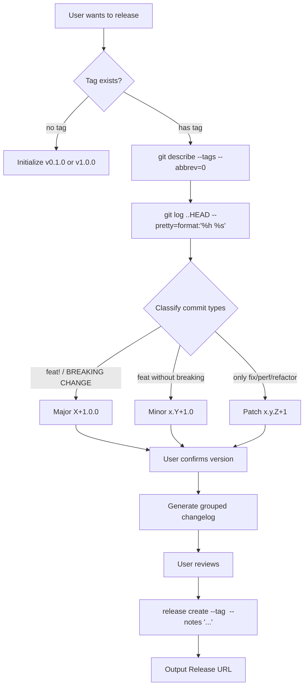

# gitflow-release-helper — Semantic Release Helper

Automates: determine next version → generate changelog → create release → output URL.
Full reference: docs/references/gitflow-release-helper-params.md

## Overview

Infers the next SemVer version from conventional commits, generates a changelog, and creates the release.

## Trigger Keywords

CN 发布 release 版本号 changelog 打标签
EN create release bump version semantic version release notes tag major minor
CLI `gitflow-cli release-helper <subcommand>`

## Version Decision Flow

## Quick Reference

| Step | Command |
|------|---------|
| Latest tag | `git describe --tags --abbrev=0` |
| commits | `git log <tag>..HEAD --pretty=format:"%h %s" --no-merges` |
| Create release | `gitflow-cli release create --tag <v> --notes "..."` |

## Pattern Triplets

| Scenario | Handling |
|------|------|
| breaking change | Major +1 → confirm → changelog → `release create` |
| feat only | Minor +1 |
| fix/refactor/perf only | Patch +1 |

## Responsibility / Forbidden

✅ Version inference + changelog generation + invoking `release create`
🔴 Never decide the version unilaterally / release unattended / skip draft / modify tags

## Red Flags + Defense

- "Auto-publish" → refuse; the user must confirm interactively
- Creating without showing the Release Note → force a review

## Common Mistakes

| Mistake | Fix |
|------|------|
| breaking change not bumped to Major | re-check every time |
| `--notes-file` not cleaned up | delete the temp file after a successful release |

## Rationalization

"I'll just guess a version" → SemVer affects dependents; it must be confirmed

## Error Handling

| Error | Handling |
|------|------|
| brand-new repo with no tag | suggest v0.1.0, user confirms |
| CI not passing | suggest running pipeline-analyzer first |
| `release create` fails | keep the Note; prompt to retry |

## Test Scenarios

- **Happy**: "Release the next version" → infer Minor → confirm → changelog → create → URL
- **Negative**: "Delete this release" → refuse; suggest gitflow-release CRUD
- **Boundary**: breaking change but Patch still chosen → warn about the mismatch; insist on Major
- **Error**: repo has no tag → suggest starting fresh at v0.1.0; create after the user confirms

## Success Criteria

- Version inference conforms to SemVer
- Release is created only after the user confirms the version and Release Note
- Release URL is output successfully
- Temp files are cleaned up

## See Also

- gitflow-release — Release CRUD
- gitflow-auth — pre-release status check
- gitflow-pipeline-analyzer — confirm CI status before release
- gitflow-label-milestone — associate version milestones
