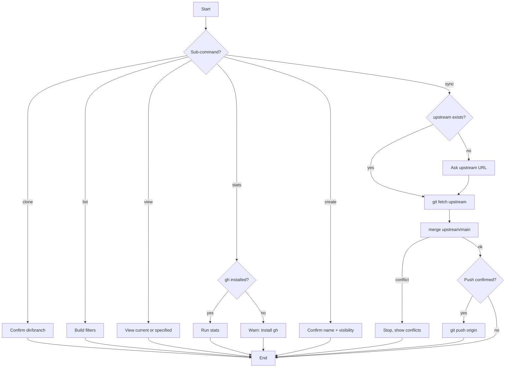

# gitflow-repo

## Overview

Encapsulates read and write operations for `gitflow-cli repo`. Covers `clone/list/stats/view` (read-only) and `create/sync` (write operations require confirmation).

## When to Use

| Trigger | 中文 | Redirect |
|---------|------|----------|
| clone / 拉代码 | clone, 拉代码 | — |
| list / my repos | 列出仓库, repo list | — |
| 仓库统计 | 统计, stars, forks | — |
| 仓库信息 | 仓库详情, 查看 | — |
| create / new repo | 创建仓库, 新建 | — |
| sync fork / 同步 fork | 同步 fork, upstream | — |
| PR workflow | — | → `gitflow-pr` |

## Core Pattern

```bash
# read-only
gitflow-cli repo clone <owner>/<repo> [--dir <d>] [--branch <b>]
gitflow-cli repo list [--org <org>] [--visibility public|private] [--language <l>]
gitflow-cli repo stats
gitflow-cli repo view [<owner>/<repo>]

# write
gitflow-cli repo create --name <n> --visibility public|private [--init]
gitflow-cli repo sync
```

## Quick Reference

| Goal | Command | Note |
|------|---------|------|
| Clone | `gitflow-cli repo clone <owner>/<repo>` | `--dir`, `--branch` |
| List | `gitflow-cli repo list` | `--org`, `--visibility`, `--language` |
| Stats | `gitflow-cli repo stats` | requires `gh` |
| View | `gitflow-cli repo view [<owner>/<repo>]` | current dir if empty |
| Create | `gitflow-cli repo create --name <n> --visibility <v> [--init]` | **write** |
| Sync | `gitflow-cli repo sync` | requires `upstream` |

## Preconditions

```bash
command -v gitflow-cli                        # CLI installed
gitflow-cli auth status --platform github     # Authenticated
test -d .git && git rev-parse --show-toplevel # Inside repo (sync/view/stats)
```

## Responsibility

**In:** select sub-command · run read-only ops · prepare write ops with confirmation.

**Out:** push without confirmation · create repo without visibility prompt · add upstream silently.

## Rationalization Excuses

| Excuse | Reality |
|--------|---------|
| "Add upstream for them" | User supplies upstream URL — never guess |
| "Push after sync" | Push always requires confirmation |
| "Visibility default OK" | Explicitly ask public/private |
| "Clone then explain" | Explain first, then execute |

## Red Flags

- 🚩 User asks to "delete a repo" — unsupported; suggest `gh repo delete`
- 🚩 "Force push after sync" — show diff, require explicit confirmation
- 🚩 "Clone all repos from org" — use `--limit`; confirm before bulk ops
- 🚩 `repo create` non-interactively — must confirm name + visibility

## Error Handling

| Error | Recovery |
|-------|----------|
| `gh` missing for `stats` | Omit stats, warn user to install GitHub CLI |
| Unauthenticated | Prompt `gitflow-cli auth login` |
| Not in git repo (sync/view) | Switch to repo dir or clone first |
| `upstream` remote missing (sync) | Prompt user for upstream URL before fetch |
| Clone — repo not found | Report exit code, suggest typo check |
| Create — name taken | Suggest alternative name |
| Sync — merge conflict | Stop, show files, ask user to resolve |

## Flowchart



## Test Scenarios

### 1: Happy Path
- **Given** `gh` installed · **When** "stats for this repo" · **Then** Run `repo stats`, output Markdown table

### 2: Negative
- **Given** "create a PR" · **When** asked to load `gitflow-repo` · **Then** NOT loaded — `gitflow-pr` handles PRs

### 3: Boundary
- **Given** sync with merge conflict · **When** `git merge` fails · **Then** Stop, show conflicts, do NOT push

### 4: Error
- **Given** `gh` missing · **When** "stats" · **Then** Omit stats, warn

## Success Criteria

- [ ] Correct sub-command per trigger
- [ ] Read-only ops execute without confirmation
- [ ] Write ops require confirmation
- [ ] Stats degrade if `gh` missing
- [ ] Stop on sync conflict

## Common Mistakes

- ❌ **Pushing after sync without explicit confirmation** — push requires user OK.
- ❌ **Auto-adding upstream remote** — always ask user for upstream URL.

## See Also

- `gitflow-repo-onboarding` — onboarding after clone
- `gitflow-auth` — auth before clone/create
- `gitflow-workflow` — workflow may start with `repo clone`

## Trigger Keywords

| English | 中文 |
|---------|------|
| clone, pull, fetch | 克隆, 拉代码 |
| list repos, my repos | 列出仓库, 我的仓库 |
| repo stats, stars, forks | 仓库统计, 数据 |
| repo info, view repo | 仓库详情, 查看仓库 |
| create repo, new repo | 创建仓库, 新建 |
| sync fork, merge upstream | 同步 fork, 上游同步 |
