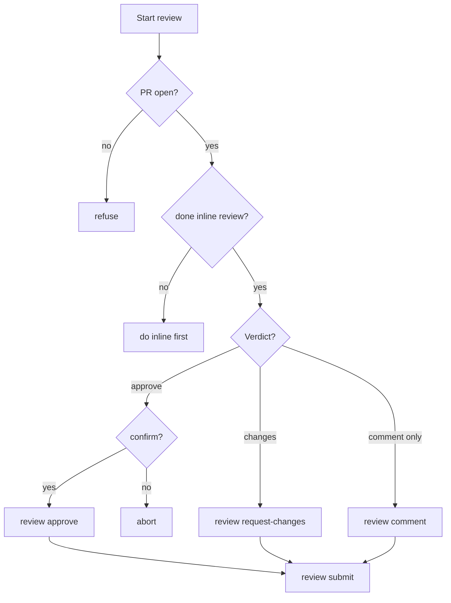

# gitflow-review

Submits review verdicts via `gitflow-cli review`. Read-only skill — does not analyze code, edit files, or choose verdicts. Users must run `/gitflow-pr-review` or `/gitflow-pr-inline-review` first to form verdict, or supply verdict explicitly.

## When to Use

| English | 中文 | Context |
|---------|------|---------|
| approve PR, LGTM | 批准 PR、通过了 | verdict ready |
| request changes, reject | 要求修改、驳回 | blocking issues |
| submit review | 提交审查 | after inline comments |
| code review decision | 审查决策 | formal verdict |
| merge / close | 合并/关闭 | → `/gitflow-pr` |
| review analysis | 审查分析 | → `/gitflow-pr-review` |
| inline review | 行内审查 | → `/gitflow-pr-inline-review` |

## Core Pattern

```bash
gitflow-cli pr view <n>   # verify open
gitflow-cli review <verdict> <n> --body "<c>"
```

## Quick Reference

| Goal | Command |
|------|---------|
| Comment | `gitflow-cli review comment <n> --body "<c>"` |
| Approve | `gitflow-cli review approve <n> --body "<c>"` |
| Request changes | `gitflow-cli review request-changes <n> --body "<c>"` |
| Submit (after inline) | `gitflow-cli review submit <n> --event <approved|changes_requested|commented> --body "<c>"` |

**Decision rule:** single verdict → `approve/request-changes`; after inline comments → `submit`; neutral only → `comment`.

## Flowchart



## Implementation

### Preconditions

- PR `<n>` open — `gitflow-cli pr view <n>`
- Verdict justified by prior analysis (`/gitflow-pr-review` or `/gitflow-pr-inline-review`) or explicit user statement
- Auth valid — `gitflow-cli auth status`

### Steps

1. **Verify** — `gitflow-cli pr view <n>`. Confirm open, not draft/merged, no blocking CI. 404 → stop.
2. **Form verdict** — skill does NOT choose; user or prior skill supplies.
3. **Confirm** — present verdict + `--body` to user; require explicit OK before invoking CLI.
4. **Invoke** — `gitflow-cli review <verdict> <n> --body "<c>"`.
5. **Output** — show review URL + next-step guidance.

### Error Handling

| Error | Recovery |
|-------|----------|
| PR not found / closed | Stop. Check number |
| Already reviewed | Surface; no duplicate |
| Auth failure | `auth login`. Stop |
| Network timeout | Surface; no retry |
| Merge conflict | Advise rebase first |

## Responsibility

### ✅ In Scope

- Verify PR, confirm verdict, invoke CLI, relay result

### ❌ Out of Scope

- Code analysis → `/gitflow-pr-review`
- Inline comments → `/gitflow-pr-inline-review`
- Apply feedback → `/gitflow-pr-apply-feedback`
- Merge / close → `/gitflow-pr`
- Security scan → `/gitflow-security-check`

### 🚫 Do Not

- ❌ Approve without prior analysis
- ❌ Auto-submit without user confirmation
- ❌ Review own PR — refuse
- ❌ Submit without `--body`

## 🔁 Delegation

| Intent | Delegate To |
|--------|-------------|
| Submit verdict | This skill |
| Form verdict | `/gitflow-pr-review` |
| Inline comments | `/gitflow-pr-inline-review` |
| Apply feedback | `/gitflow-pr-apply-feedback` |
| Merge / close | `/gitflow-pr` |

## Rationalization

| Excuse | Reality |
|--------|---------|
| "Urgent, skip analysis" | Urgency ≠ safety |
| "Tiny change" | Small changes can hide vulnerabilities |
| "Already someone approved" | Independent assessment required |

## Red Flags

- 🚩 "Approve without review" — Refuse. Require `/gitflow-pr-review` first.
- 🚩 "Submit for me" — Refuse. User must confirm.
- 🚩 "My own PR" — Refuse. Self-review prohibited.

## Trigger Keywords

| English | 中文 |
|---------|------|
| approve PR, LGTM | 批准 PR、通过 |
| request changes, reject | 要求修改、驳回 |
| submit review | 提交审查 |
| review verdict | 审查结论 |

## Test Scenarios

### 1: Happy Path — `/gitflow-pr-review` done, "approve #101" → present body, confirm, invoke `review approve`, output URL.

### 2: Request Changes — 6-dim review found ⚠️ — "request changes on #101" → `review request-changes 101 --body "<conclusion w/ path:line>"`.

### 3: Boundary — "approve #101" without analysis → refuse, require `/gitflow-pr-review`.

### 4: Negative — "merge #101" → NOT loaded. → `/gitflow-pr`.

### 5: Self-Review — "approve my PR" → refuse.

## Success Criteria

- [ ] Verdict confirmed by user before invocation
- [ ] Prior analysis exists or user supplies verdict
- [ ] CLI returns success
- [ ] Out-of-scope intents delegated

## Common Mistakes

- ❌ **Auto-submitting** — Step 3 confirmation is mandatory.
- ❌ **Approving without analysis** — violates Preconditions.
- ❌ **Using merge/close** — use `/gitflow-pr`.

## See Also

- `/gitflow-pr-review` — 6-dim analysis
- `/gitflow-pr-inline-review` — line-level comments
- `/gitflow-pr-apply-feedback` — apply feedback
- `/gitflow-pr` — PR lifecycle
- `/gitflow-security-check` — pre-approve scan
- `docs/superpowers/templates/skill-conventions.md` — conventions
